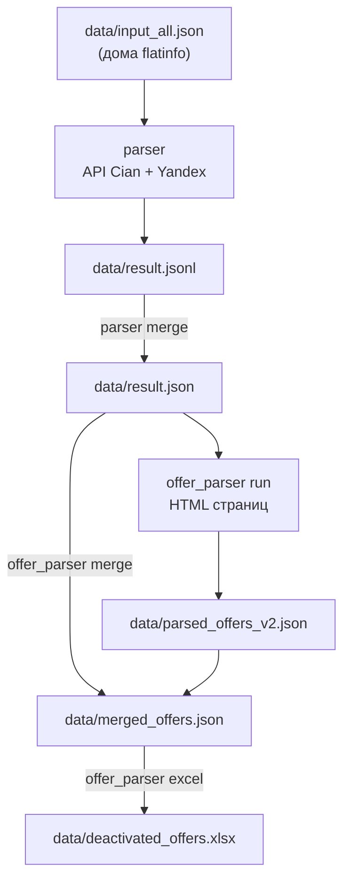

# CIAN — парсинг снятых объявлений

Двухэтапный пайплайн для сбора истории деактивированных объявлений по домам Москвы и детального парсинга страниц объявлений с выгрузкой в Excel.



---

## Установка

Из корня репозитория (`secondsprint`):

```bash
pip install -r cian/requirements.txt
```

### Конфигурация

| Файл / переменная | Назначение |
|---|---|
| `cian/cookies.txt` | Cookies Cian для **parser** (этап 1). Шаблон: `cookies.example.txt` |
| `CIAN_COOKIES` | Альтернатива `cookies.txt` (строка `name=value; ...`) |
| Cookie-сервер | По умолчанию `http://72.56.33.73:8000/cookies` — JSON-массив `[{name, value}, ...]` |
| `CIAN_COOKIE_SERVER_URL` | Переопределить URL cookie-сервера |
| `cian/.env` | Опционально: `YANDEX_SUGGEST_API_KEY`, `CIAN_PROXY` |
| `cian/data/proxies.txt` | Прокси для details API (этап 1) и **offer_parser** (этап 2), по одному на строку |

---

## Структура проекта

```
cian/
├── README.md                 # этот файл
├── pipeline.md               # исходное ТЗ по этапу 1
├── requirements.txt          # зависимости обоих этапов
├── run.py                    # точка входа parser (из папки cian/)
├── cookies.example.txt
│
├── parser/                   # ЭТАП 1: дома → список снятых объявлений (API)
│   ├── cli.py                # CLI: run, merge, smoke-test
│   ├── pipeline.py           # Yandex → geocode → house ID → offers → details
│   ├── runner.py             # параллельные воркеры (дома + details)
│   ├── offer_details.py      # обогащение offers через details API
│   ├── proxy.py              # ProxyManager для details
│   ├── smoke_test.py         # smoke-прогон на случайной выборке
│   ├── test_models.py        # unit-тесты parse_title / features
│   ├── models.py             # InputHouse, DeactivatedOffer, ParsedHouse
│   ├── io.py                 # JSONL writer, merge в JSON
│   ├── config.py             # Settings, cookies, API keys
│   ├── address.py
│   └── clients/
│       ├── cian.py           # geocode-cached, geocode-for-search, offer history
│       ├── yandex.py         # Yandex Suggest
│       └── http.py
│
├── offer_parser/             # ЭТАП 2: страница объявления → JSON + Excel
│   ├── main.py               # CLI: run, merge, excel, ids, test-local
│   ├── export_schema.py      # JSON = колонки Excel (EXCEL_COLUMNS)
│   ├── extractor.py          # OfferData, DOM + state fallback
│   ├── state_extractor.py    # defaultState из window._cianConfig
│   └── client.py             # curl_cffi, прокси, cookies с сервера
│
├── data/                     # рабочие данные (часть в .gitignore)
│   ├── input_all.json        # вход: все дома Москвы (flatinfo)
│   ├── result.jsonl          # выход этапа 1 (построчно, по домам)
│   ├── failed.jsonl          # ошибки этапа 1
│   ├── result.json           # result.jsonl → единый JSON-массив
│   ├── parsed_offers_v2.json # выход offer_parser run
│   ├── merged_offers.json    # parsed + метаданные из result.json
│   ├── deactivated_offers.xlsx
│   └── proxies.txt
│
└── examples/                 # примеры запросов и ответов API
    ├── *.bash                # curl-шаблоны
    ├── *_response.json       # образцы ответов
    ├── cian-sale-flat.html   # сохранённая страница объявления
    └── default-state-example.json
```

---

## Этап 1 — `parser`: дома → снятые объявления

Для каждого дома из входного JSON:

1. Yandex Suggest — нормализация адреса
2. Cian `geocode-cached` — координаты и kind
3. Cian `geocode-for-search` — `cian_house_id`
4. Cian `get-house-offer-history-desktop` — объявления со `status: "deactivated"`
5. Cian `get-offer-from-history-web` — для каждого offer: images, address, features (пул `--detail-workers`, прокси из `proxies.txt`)

### Команды

Запуск из корня репозитория:

```bash
# Основной прогон (по умолчанию: Москва, жилые дома, 16 house + 32 detail воркеров)
python -m cian.parser -i cian/data/input_all.json -o cian/data/result.jsonl --failed cian/data/failed.jsonl

# Тест на N домах
python -m cian.parser -i cian/data/input_all.json --limit 10 -w 4 --detail-workers 8

# Без обогащения details (старое поведение)
python -m cian.parser --skip-details

# Smoke-тест: 40 случайных домов + отчёт
python -m cian.parser smoke-test --sample-size 40 --seed 42 -w 4 --detail-workers 16

# Повторный анализ smoke без нового прогона
python -m cian.parser smoke-test --analyze-only cian/data/smoke_test_result.jsonl

# Unit-тесты парсинга title/features
python -m unittest cian.parser.test_models

# Повторить только упавшие из failed.jsonl
python -m cian.parser --retry-failed

# Собрать JSONL → один JSON-файл
python -m cian.parser merge cian/data/result.jsonl cian/data/result.json
```

Альтернатива — из папки `cian/`:

```bash
cd cian
python run.py -i data/input_all.json -o data/result.jsonl
python run.py merge data/result.jsonl data/result.json
```

### Выход этапа 1

**`data/result.jsonl`** — одна строка JSON на дом:

```json
{
  "source": {
    "house_id": 26391,
    "city": "Москва",
    "street": "улица Академика Павлова",
    "house_num": "д.13",
    "year": "1971",
    "flats": "712",
    "lat": "55.74401",
    "lng": "37.39778"
  },
  "yandex_formatted_address": "Россия, Москва, улица Академика Павлова, 13",
  "geocode": { "text": "...", "kind": "house" },
  "cian": {
    "cian_house_id": 123456,
    "lat": 55.744,
    "lng": 37.397,
    "address": "...",
    "region_id": 1,
    "street_id": 1381,
    "location_id": 1
  },
  "offers_total_count": 42,
  "roomCounts": [
    {"offersCount": 32, "roomsCount": "two"},
    {"offersCount": 16, "roomsCount": "three"}
  ],
  "deactivated_offers": [
    {
      "id": 330139464,
      "title": "73,4 м² · 3-комн. · 13/15 этаж",
      "link": "/sale/flat/330139464/?mlSearchSessionGuid=...",
      "prices": {
        "price": "35,0 млн ₽",
        "priceSqm": "476 839 ₽/м²",
        "priceDiff": "noChange"
      },
      "exposition": "172 дня",
      "status": "deactivated",
      "dateStart": "9 дек 2025",
      "dateEnd": "2 дек 2025",
      "previewPhoto": "https://images.cdn-cian.ru/...",
      "title_parsed": {
        "total_area_sqm": 73.4,
        "rooms": 3,
        "floor_current": 13,
        "floor_total": 15
      },
      "details": {
        "address": "Москва, Трифоновская улица, 11",
        "images": ["https://images.cdn-cian.ru/..."],
        "features": [
          {"title": "Тип дома", "value": "Монолитный"},
          {"title": "Год постройки", "value": "1981"}
        ],
        "features_parsed": {
          "building_type": "Монолитный",
          "build_year": 1981,
          "living_area_sqm": 50.0
        }
      }
    }
  ],
  "parsed_at": "2026-06-09T12:00:00+00:00"
}
```

**`data/failed.jsonl`** — ошибки по домам:

```json
{
  "source": { "house_id": 12345, "street": "...", "house_num": "..." },
  "stage": "geocode",
  "error": "описание ошибки",
  "parsed_at": "..."
}
```

**`data/result.json`** — массив всех успешных домов (после `merge`). Используется как вход для этапа 2.

---

## Этап 2 — `offer_parser`: страницы объявлений → JSON + Excel

Для каждого `deactivated_offers[].id` скачивается HTML страницы `cian.ru/sale/flat/{id}/` и извлекаются данные из встроенного `defaultState` (с fallback на DOM).

### Команды

```bash
# 1. Парсинг страниц (из result.json берутся все deactivated_offers)
python -m cian.offer_parser run \
  -i cian/data/result.json \
  -o cian/data/parsed_offers_v2.json \
  --resume -w 5

# Тест на 10 объявлениях
python -m cian.offer_parser run \
  -i cian/data/result.json \
  -o cian/data/parsed_offers_v2.json \
  --limit 10 -w 3

# 2. Слияние: спарсенные данные + метаданные API (dateStart, exposition, priceDiff)
python -m cian.offer_parser merge \
  -i cian/data/result.json \
  -p cian/data/parsed_offers_v2.json \
  -o cian/data/merged_offers.json

# 3. Excel
python -m cian.offer_parser excel \
  -i cian/data/merged_offers.json \
  -o cian/data/deactivated_offers.xlsx

# Парсинг конкретных ID (через пробел)
python -m cian.offer_parser ids 304440050 311189746 306521294 \
  -o cian/data/parsed_offers.json

# С метаданными из result.json (dateStart, exposition, priceDiff)
python -m cian.offer_parser ids 304440050 311189746 \
  -m cian/data/result.json \
  -o cian/data/parsed_offers.json

# Локальный тест без сети
python -m cian.offer_parser test-local cian/examples/cian-sale-flat.html
```

| Флаг | Описание |
|---|---|
| `--resume` | Пропускать ID, уже есть в выходном JSON |
| `-w` | Число параллельных воркеров |
| `--proxies` | Путь к файлу прокси (по умолчанию `data/proxies.txt`) |
| `--retries`, `--delay`, `--timeout` | Повторы и таймауты HTTP |

При ошибках создаётся `{output_stem}_errors.json` рядом с выходным JSON.

### Выход этапа 2 — JSON (`parsed_offers.json` / `merged_offers.json`)

JSON на **английском** (snake_case). Поля без значения **не включаются**. Район, микрорайон, поселение и ЖК — пока не выводятся (в Excel остаются пустыми):

```json
{
  "offer_id": "316587308",
  "url": "https://cian.ru/sale/flat/316587308/",
  "address": "Москва, Сосенское поселение, ул. Николо-Хованская, 16",
  "region": "Москва",
  "street": "ул. Николо-Хованская",
  "house": "16",
  "metro": [
    { "name": "Ольховая", "walk_min": null, "transport_min": 4 },
    { "name": "Прокшино", "walk_min": 24, "transport_min": null }
  ],
  "construction_year": 2014,
  "floors_total": 9,
  "floor": 1,
  "rooms": 3,
  "housing_type": "Вторичка",
  "renovation": "Евроремонт",
  "total_area": 84.6,
  "living_area": 56.0,
  "kitchen_area": 12.0,
  "ceiling_height": 2.9,
  "price": 19500000,
  "price_per_sqm": 230496,
  "price_change": "noChange",
  "seller_url": "https://www.cian.ru/agents/96700902/",
  "published_at": "9 июл 2024",
  "created_at": "2025-04-21",
  "days_on_site": "150 дней",
  "source": "Cian",
  "agent": { "..." : "..." },
  "railways": [ { "id": 693, "name": "...", "travel_type": "by_foot", "time_min": 31 } ],
  "factoids": { "total_area": 84.6, "ceiling_height": 2.9 }
}
```

`ceiling_height` берётся из `building.ceilingHeight`, factoids или `features.aboutFlat` («Высота потолков»).

Команда `excel` маппит этот JSON в 38 русских колонок.

### Выход этапа 2 — Excel (`deactivated_offers.xlsx`)

Те же 38 колонок, что в JSON (без `_extra`). Порядок фиксирован в `export_schema.EXCEL_COLUMNS`.

Без `merge` колонки «Опубликовано», «Дней на сайте», «Изменение цены» будут пустыми.

---

## Полный пайплайн (шпаргалка)

```bash
# Этап 1
python -m cian.parser -i cian/data/input_all.json -o cian/data/result.jsonl -w 16
python -m cian.parser merge cian/data/result.jsonl cian/data/result.json

# Этап 2
python -m cian.offer_parser run -i cian/data/result.json -o cian/data/parsed_offers_v2.json --resume -w 5
python -m cian.offer_parser merge -i cian/data/result.json -p cian/data/parsed_offers_v2.json -o cian/data/merged_offers.json
python -m cian.offer_parser excel -i cian/data/merged_offers.json -o cian/data/deactivated_offers.xlsx
```

---

## Зависимости

| Пакет | Использование |
|---|---|
| `requests`, `curl_cffi` | HTTP-запросы |
| `beautifulsoup4` | DOM-парсинг страниц |
| `chompjs` | Парсинг JS/JSON из `defaultState` |
| `pandas`, `openpyxl` | Экспорт в Excel |

---

## Примеры (`examples/`)

| Файл | Описание |
|---|---|
| `yandex-suggest-address.bash` | Нормализация адреса через Yandex |
| `geocode-cached.bash` | Кэшированный геокод Cian |
| `geocode-for-search.bash` | Поиск house ID |
| `get-house-offer-history-desktop.bash` | История объявлений дома |
| `cian-sale-flat.html` | Пример HTML страницы объявления |
| `default-state-example.json` | Фрагмент `defaultState` со страницы |

Подробное описание логики этапа 1 — в [`pipeline.md`](pipeline.md).
